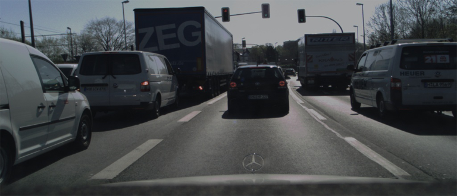
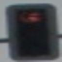
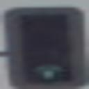
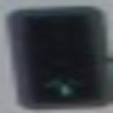

# Traffic Light Annotation Tool


This tool is used to annotate traffic lights in images for the purpose of training a traffic light detection model. The tool is designed to be user-friendly and efficient, and it is used to annotate traffic lights for both Object Detection and State Detection. The tool is designed to be used by multiple annotators, and it includes a user login system and a statistics window to compare the performance of the annotators.

## Table of Contents
- [Traffic Light Annotation Tool](#traffic-light-annotation-tool)
  - [Table of Contents](#table-of-contents)
  - [Installation Guide](#installation-guide)
    - [Prerequisites](#prerequisites)
    - [Installation Steps](#installation-steps)
  - [Usage](#usage)
    - [Annotation](#annotation)
    - [Navigation](#navigation)
  - [Output Formats](#output-formats)
    - [Object Detection (OD)](#object-detection-od)
    - [State Detection (SD)](#state-detection-sd)
  - [Annotation Guidelines](#annotation-guidelines)
  


## Installation Guide
### Prerequisites
- Python 3.7 or higher
- pip package manager

### Installation Steps

1. Clone the repository:
  ```bash
  git clone https://github.com/FridtjofS/TrafficLightDetection.git
  ```

2. Navigate to the project directory:
  ```bash
  cd TrafficLightDetection/Annotation/GUI
  ```

3. Install the required dependencies:
  ```bash
  pip install -r requirements.txt
  ```

4. Run the annotation tool:
  ```bash
  python main.py
  ```

## Usage

1. Launch the annotation tool by running the `main.py` script.

2. Upon starting the tool, the Settings Window will open.
    - **Login as:** Select your user name from the drop-down menu. Your Settings will be loaded automatically.
    - **Path to input folder:** Select the folder containing the images to be annotated.
    - **Path to OD-output folder:** Select the folder where the annotations will be saved for Object Detection (OD), in the format of an Image and a JSON file with the same name, with a List of Traffic Light  Bounding Boxes and their respective colors.
    - **Path to SD-output folder:** Select the folder where the annotations will be saved for State Detection (SD), here every traffic light gets cropped and saved as a single image in 128x128 pixels, with a json  file containing the color of the traffic light.
    - **Output Image Size:** Select the size of the output images for Object Detection.

3. Click the **Save Settings** button to start the annotation tool, and the first image of your input folder will be displayed.

### Annotation
- To annotate a traffic light, drag a bounding box around it by holding the left mouse button and dragging the mouse. To move the boundingbox, drag your Mouse while pressing space.
- You can also input or finetune the values for the bounding box manually, on the left.
- To change the color of the traffic light, click on the respective color button on the right. If the Traffic Light is Off, you need toclick on a Color Button Once, and turn it off again by clicking on the  same   button again. For red-yellow click on red, then yellow, orvice versa.
- You can also change the color of the traffic light by pressing the respective key on your keyboard. The keys are: 
    - **1:** Off
    - **2:** Red
    - **3:** Red-Yellow
    - **4:** Yellow
    - **5:** Green
- If you are happy with your current annotation, Press Enter or Shift, or the small green checkmark on the currently editinhg Traffic Light Card. Nowyou can keep adding Traffic Lights, or move on.
- If you want to edit a Traffic Light, you can edit the respective Traffic Light Card on the left, or delete it by pressing the small red Xon the Traffic Light Card. To delete the last Traffic Light, press Backspace.

### Navigation
- To Save your Image and Annotations, press big Right Arrow Button below the Image or press the Right Arrow Key on your Keyboard.
- To go back to the previous Image and undo your changes, press the big Left Arrow Button below the Image or press the Left Arrow Key onyour Keyboard.
- To open the Settings Window again, press the small Gear Icon in the lower left corner.
- To End the Annotation Tool press **End Session** in the lower left corner. Here the Statistic Window will appear, and you can compareyourself to your fellow annotators.

---

## Output Formats
### Object Detection (OD)
The annotations for Object Detection are saved in a txt File in the YOLO format, containing the bounding box coordinates. The images are saved in the same folder as the txt file, with the same name. The YOLO format measures the coordinates of the bounding box as a fraction of the image size, from 0 to 1.
```txt
  0 x_center1 y_center1 width1 height1
  0 x_center2 y_center2 width2 height2
  ...
```
<details>
  <summary><b>Example</b></summary>
  
  **Input Image:**

  

  **YOLO Output:**
  ```txt
  0 0.49398148148148147 0.07385398981324279 0.021296296296296296 0.07979626485568761
  0 0.5814814814814815 0.05432937181663837 0.020370370370370372 0.08149405772495756
  0 0.6597222222222222 0.08149405772495756 0.019444444444444445 0.07809847198641766
  ```
</details>

### State Detection (SD)
The annotated Traffic Lights are cropped and saved as single images in 128x128 pixels, with a json file containing the state of the traffic light. The images are saved in the same folder as the json file, with the same name.
```json
{"state": "0"}
```
<details>
  <summary><b>Example</b></summary>
  
  **Input Image:**

  

  **SD Output:**

    
  ```json
  {"state": "1"} {"state": "4"} {"state": "4"}
  ```
</details>


## Annotation Guidelines

- Annotate all fully visible traffic lights in the image, even if they are off.
- Only annotate traffic lights that are mostly front facing.
- Do not annotate traffic lights that are occluded more than 30%, or not all lights are visible.
- Draw the bounding box as tightly as possible around the traffic light, but include some background rather than cutting off the traffic light.
- Only annotate traffic lights with 3 lights, but include ones with arrows or different shapes.


