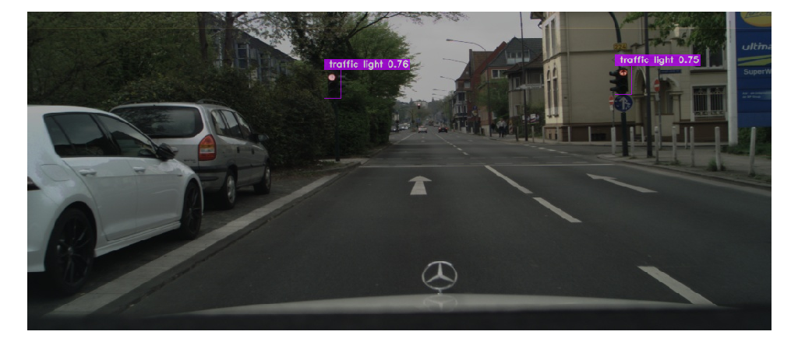

<!-- ABOUT THE PROJECT -->
## Object Detection



This Folder contains files to finetune, test and run inference with a YOLO NAS model for traffic light detection.
To see an overview of the entire Traffic Light Detection Pipeline, please visit the [TrafficLightDetection Readme](../README.md).

<!-- Structure -->
## Structure
``` 
├── checkpoints: Directory containing information about different finetuning RUNS for each model architecture   
│   ├── yolo_nas_l   
│   │   ├── Runs named by mAP@0.50:0.95 on test set. E.g. 0417 = 41.7%   
│   │   └── ...   
│   ├── yolo_nas_s   
│       └── ...   
├── finetuning   
│   ├── config.json: config file that sets relevant parameters for finetuning   
│   ├── finetune.py: script to finetune YOLO NAS   
│   ├── split_dataset.py: script to create TRAIN-VAL-TEST split   
│   └── test.py: script to infer and save test metrics for single finetuning RUNS within checkpoints/architecture/. Run from .../TrafficLightdetection 
├── od_train_data   
│   ├── dataset: annotated data in YOLO dataset format   
│   ├── dataset_stats: files that document the annotation distribution in the dataset   
│   └── raw_dataset: unsplitted, annotated data   
├── assets   
│   ├── analyze_dataset.py: script to output dataset distribution of traffic light counts for given YOLO dataset   
│   └── README_title.png: sample image for this README   
└── predict.py: script containing a PREDICTOR class that provides a predict funktion for our pipeline   
```

## Usage

In order to make use of the pipeline, please download the weights from checkpoints/yolo_nas_l/0500: https://drive.google.com/drive/folders/1-4o9YRjkEMhg8KZSAYL6zUqyrECsglz4?usp=sharing and save them to the respective folder in the repository. In order to make use of different weights uploaded, please see below how to adapt the scripts. 
In general, run scripts from TrafficLightDetection folder in order to assure working paths. All beside test.py should work from arbitrary directory though. 

**predict.py**    
Visualize finetuned model predictions for 3 random samples from the test set. 
```python predict.py```

**finetuning/split_dataset.py**    
Carry out a train val test split on a given dataset of our structure. Split ratios and seed to be defined at top of script. 
```python split_dataset.py --datatset_folder 'path_to_ObjectDetection/od_train_data/raw_dataset' --output_folder 'path_to_ObjectDetection/od_train_data/<dataset_name>'```

**assets/analyze_dataset.py**    
Check the distribution of traffic light counts per sample in a given YOLO dataset.   
```python analyze_dataset.py --input_folder 'path_to_ObjectDetection/od_train_data/<dataset_name>' --output_folder 'path_to_ObjectDetection/od_train_data/<dataset_name>'```

**finetuning/finetune.py**    
Start a finetuning RUN with the parameters set in config.json. Specify the path to the weights to choose as a global one, as this is required. In case you wish to change the weights to be used, access line 72 in predict.py (also consider the model architecture).
```python finetune.py```

**finetuning/test.py**   
Test a finetuning RUNs wheights with the parameters set in config.json on the test set.
Run from .../TrafficLightdetection!  
```python test.py --architecture 'yolo_nas_l' --run '<name_of_RUN_folder>'```


