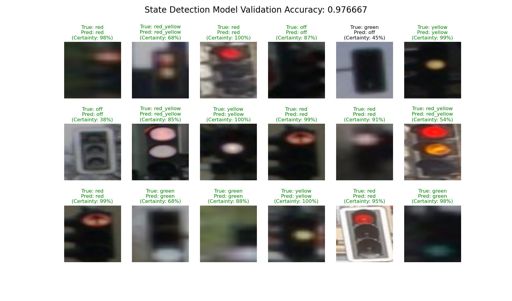

# State Detection



This directory is dedicated to training the State Detection model for our TrafficLightDetection tool. The model is a ResNet convolutional neural network that gets images of traffic lights as inputs and predicts one of five stated for them: off, red, red-yellow, yellow, or green. To see an overview of the entire Traffic Light Detection Pipeline, please visit the [TrafficLightDetection Readme](../README.md).

### General Notes:
- This script uses the experimental `DirectML` package for training models on GPUs that don't have CUDA support. This package is still in development and may not work on all systems, more info can be found [here](https://learn.microsoft.com/en-us/windows/ai/directml/gpu-pytorch-windows)
The script will first try to use CUDA, then DirectML, and then automatically fall back to using the CPU if the DirectML package is not available.
    To install the DirectML package, run the following command:
    ```bash
    pip install torch-directml
    ```

<!-- Structure -->
## Structure
``` 
├── models
│   ├── model_[randomID]
│   │   ├── log.txt: Training log with model hyperparameters
│   │   ├── model.pth Best trained model
│   │   ├── loss_acc.png: Loss and accuracy plot over epochs
│   │   ├── confusion_matrix.png: Confusion matrix of the trained model
│   │   ├── final_prediction.png: Final prediction of the trained model of one batch
│   │   ├── sample_images: Sample images used for training
│   │   ├── sample_val_images: Sample images used for validation
│   │   ├── train_loss_list.pkl: Pickle file containing the training loss list
│   │   ├── val_acc_list.pkl: Pickle file containing the validation accuracy list
├── sd_train_data: Folder containing the training data in .jpg and .json pairs
│   ├── image_0.jpg: Image file
│   ├── image_0.json: JSON file containing the ground truth
│   ├── ...
├── data_augmentation.py: Script for data augmentation (load images with larger BBoxes)
├── dataset.py: Script for creating the dataset
├── ResNet.py: Script for the ResNet model architecture
├── train.py: Script for training the model
├── predict.py: Script containing a PREDICTOR class for our pipeline
├── utils.py: Script for utility functions
├── README.md: This file
```

<!-- Usage -->
## Usage

### Training

Assuming your working directory is the `StateDetection` folder (or modify you python command accordinglys), you can train a model by running the following command:
```bash
python train.py
```
Various hyperparameters can be adjusted in the `train.py` file, such as the learning rate, batch size, number of epochs, etc.

### Predicting

To use the trained model for prediction, you can use the `predict.py` script. The predictor class provides a `predict` function which takes a list of images as input and returns the predicted states and probabilities. An example of how to use the `predict` function is provided in the `predict.py` file.

<!-- Data -->
## Data

The training data should be placed in the `sd_train_data` folder. The data should be in the form of .jpg and .json pairs, where the .json file contains the ground state in the format ``{"state": 1}``. The `dataset.py` script will automatically load the data and create the dataset for training, creating an 80 / 20 split for training and validation data. When calling the `train` function in the `train.py` script, the model will be trained on the training data and validated on the validation data. An important parameter of the `train.py` script is the ``max_keep`` argument, which defines up to how many samples to keep of each state. This is useful for balancing the dataset, as states with fewer samples will be duplicated to ``max_keep`` samples, and states with more samples will be randomly sampled to ``max_keep`` samples.
The default value is 1200, meaning that each state will have 1200 samples.

### Data Augmentation

The `data_augmentation.py` script can be used to augment the training data by loading images with larger bounding boxes. This can be useful for training the model to detect states in bounding boxes predicted by the object detection model. The new images and JSON files will be saved in a new folder called `augmented_dataset`. To use the script, run the following command:
```bash 
python data_augmentation.py
```
The script will create a new folder `augmented_dataset` containing the augmented images and JSON files.
